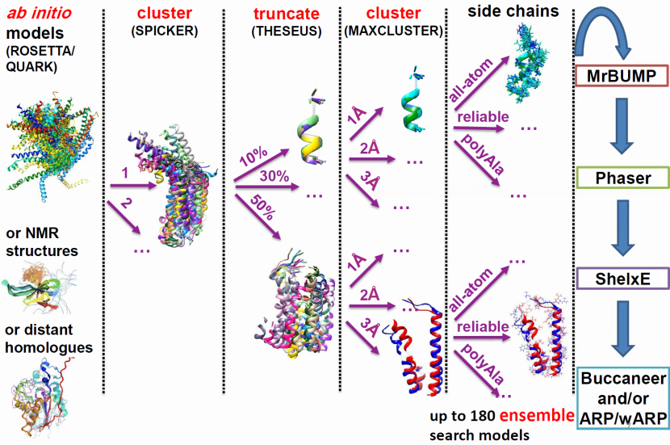

.. _description:

***********
Description
***********

AMPLE is a pipeline for unconventional Molecular Replacement. It exploits advances in protein bioinformatics to generate search models from structure predictions or available crystal structures.  These search models, which may be many in number, are then fed to MrBUMP where they are placed with PHASER and/or MOLREP. For each resulting placement, phase modification and main chain rebuilding with SHELXE is attempted, optionally followed with further model completion with ARP/wARP or BUCCANEER.

AMPLE originated as a means to process rapidly obtained, low-resolution ab initio structure predictions, ‘decoys’ in the jargon of the field, into ensemble search models. Indeed, AMPLE’s name comes from ‘ab initio modelling of proteins for molecular replacement’. *Ab initio* modelling can be attempted even when no homologous known structures can be identified for a target, extending MR to novel folds.  AMPLE uses *ab initio* models either from locally installed ROSETTA or obtained at the QUARK server.

The key elements of AMPLE’s workings are clustering and truncation. Clustering identifies the most likely correct fold predictions from among large sets of ab initio models. Structural variance within these clusters is indicative of likely error – the most diverse regions tend to be the least reliably modelled – and is used to drive truncation of cluster-derived structure ensembles. Alternative side chain treatments and sub-clustering at different levels of structural homogeneity are applied resulting in a potentially large number of search models to trial from each cluster sampled.

Benchmarking of this approach on a large set of small globular proteins (<120 residues) solved around half, with success much more frequent for all-α proteins than for all-β targets, with mixed folds intermediate. In favourable cases where the target is a member of a large family of sequences, allowing for prediction of residue contacts, we have solved targets, treated as novel folds, of up to around 220 residues. We have also shown that this approach solves 80% of coiled-coil proteins, independent of their architecture.

The cluster-and-truncate approach is suitable for any kind of input structures in which structurally variable regions should be considered of lesser value. Thus, AMPLE works very well when fed an NMR ensemble as input, can profitably superimpose sets of distant homologues and can work with sets of homology models eg from ROSETTA_CM or I-TASSER. Finally, we have unpublished findings suggesting that a set of structures calculated for a single distant homologue with CONCOORD can be an effective input. 

.. _description_video:

This webinar from April 2016 comes courtesy of our colleagues at `SBgrid`_.

.. raw:: html

  <iframe width="560" height="315" src="https://www.youtube.com/embed/_gLbqAIUuZM" frameborder="0" allowfullscreen></iframe>

.. _SBgrid: https://sbgrid.org/
