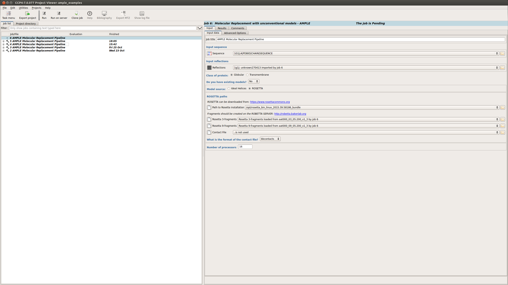
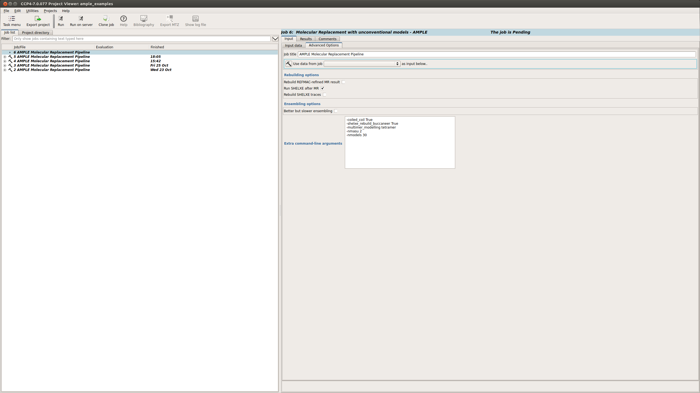
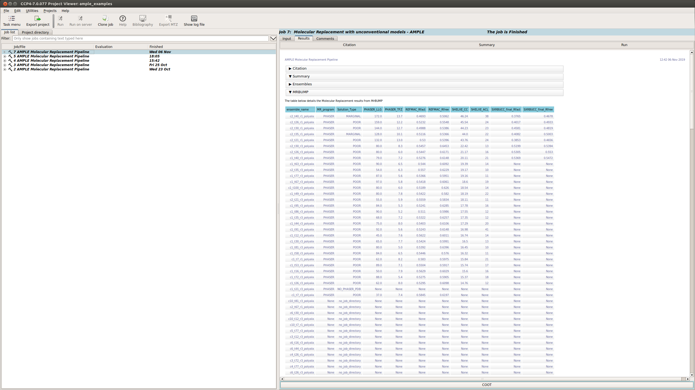
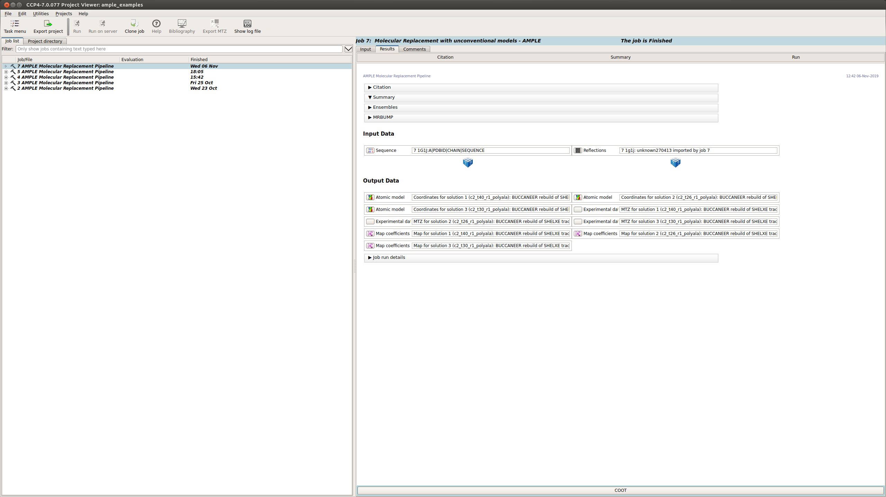
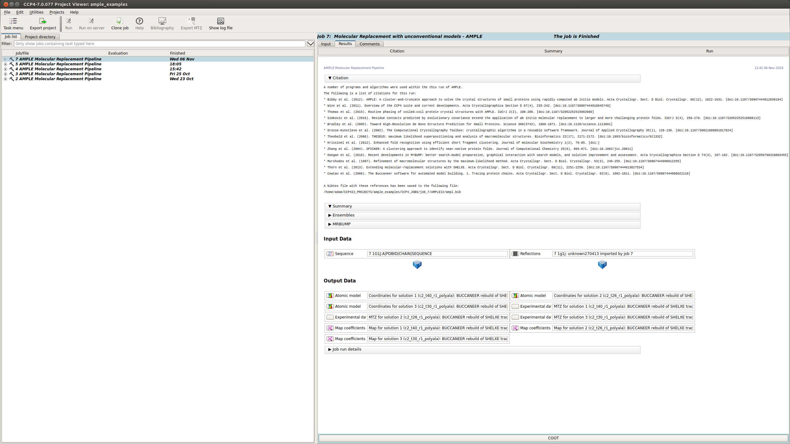

.. _example_ccp4i2_coiled:

========================
Using *ab initio* models
========================

Rosetta Installation
====================
ROSETTA must be installed on the local system before AMPLE can be used to generate *ab inito* models. AMPLE needs to know the location of the ROSETTA installation in order to find all of the various tools it needs for creating decoy structures. Please ensure that the path to the ROSETTA top level directory is specified in the interface or with the ``-rosetta_dir`` flag if using a script.

.. note::
   ROSETTA is a comprehensive package and requires compilation from source code. For a detailed explanation about how to install ROSETTA see `ROSETTA installation`_.

------------------------------------------------------------------

Running AMPLE
=============

AMPLE can be found in the CCP4i2 menu under the Molecular replacement tab (shown below)

.. figure:: ../images/ccp4i2_menu.png
   :align: center

This will take you to the submission page for AMPLE.

Submission options
------------------

On the submission page there are a number of input options:

.. figure:: ../images/ccp4i2_ample_submit.png
   :align: center

1. Input sequence – Path to the FASTA file
2. Input MTZ - Path to the MTZ file
3. Protein classification - Globular or Transmembrane
4. Model selection or building - select between a directory of existing models, a library of ideal helices or create *ab initio* models locally (shown below).

.. note::
    A Coiled-coil option will also be available soon

Advanced options
----------------

There is also an advanced options tab

.. figure:: ../images/ccp4i2_ample_advanced.png
   :align: center

This provides options relating to:

1. The rebuilding of the structure
2. Ensembling
3. And a box to add any other run flags not already available through the GUI.

For a full list possible options see :ref:`AMPLE options <cl_options>`.

Example
=======
Input Files
-----------
AMPLE requires a FASTA file and an MTZ file in order to run. There are some other files required, which will be described below.

.. note::
   You can download all the data files `here <hhttps://github.com/rigdenlab/ample-examples/archive/master.zip>`_.

Rosetta Input Files
-------------------
For *ab initio* modelling ROSETTA requires Robetta fragment files (3 and 9 residues), (fragment files can be generated using the `Robetta online server`_. Note that registration is required for this service). For this example these fragment files have already been calculated and part of the downloaded files.

AMPLE Setup
-----------

The FASTA and MTZ files can be submitted into the fields described above

When running Rosetta the following options need to be input:

1. The path to the Rosetta installation
2. location of the 3 residue fragment from the Robetta server
3. location of the 9 residue fragment from the Robetta server

Additionally when running a coiled-coil job, a few advanced options need to be input:

.. note::
   AMPLE's CCP4i2 interface is going to be modified to contain coiled-coil specific options in the near future.

Once these options have been selected the job can be set running.

AMPLE Output
============
On starting a separate window will appear summarising the progress of AMPLE and any results. The window will contain up to three tabs, the contents of which are explained below:

Summary
-------
The summary tab contains different sections. Below you can find information about each:

Ensembling Results
^^^^^^^^^^^^^^^^^^
There is a brief summary of the type of truncation that was undertaken and then a table listing each ensemble. The columns of the table are:

.. figure:: ../images/ccp4i2_summary_ensembling_coiled.png
   :align: center

* **Name:** the name of the ensemble. This is used to name the pdb file and the directory where mrbump carries out molecular replacement.
* **Truncation Level:** the percentage of the model remaining after the varying residues were pruned away.
* **Variance Threshold:** AMPLE constructs ensembles by pruning back the most variable residues based on their variance as calculated by THESEUS. The variance threshold is the THESEUS variance score for the most variable residue that remains in this ensemble.
* **No. Residues:** the number of residues for each model in the ensemble.
* **Radius Threshold:** the truncated models are sub-clustered after truncation under 3 different radius thresholds to create the ensemble, and this is the radius used for this sub-cluster.
* **No. Decoys:** the number of models within this ensemble.
* **Number of Atoms:** the number of atoms for each model in the ensemble.
* **Sidechain Treatment:**

  * *allatom* – all sidechains were retained
  * *reliable* – MET, ASP, PRO, GLN, LYS, ARG, GLU, SER were retained
  * *polyAla* – all sidechains were stripped back to polyalanine

MrBUMP Results
^^^^^^^^^^^^^^
This section displays a table with the results of running MrBUMP on each of the ensembles, for this example you will have information for the following headings.

* **ensemble_name:** this matches the name from the ensemble section.
* **MR_program:** the program used for Molecular Replacement.
* **Solution type:** the MrBUMP categorisation of the solution

  * *GOOD* - final Rfree <=0.35
  * *MARGINAL* - final Rfree <= 0.48 OR final Rfree <= 0.5 and the ratio between the initial and final Rfree is <= 0.8, OR final Rfree <= 0.55 and the ratio between the initial and final Rfree is <= 0.95
  * *POOR* - anything else
  * *no_job_directory* - a script has been prepared, but the job hasn’t been run yet
  * *unfinished* - the job is running or has stopped without generating any results

* **PHASER_LLG:** the PHASER log-likelihood gain for the Molecular Replacement solution.
* **PHASER_TFZ:** PHASER Translation Function Z-score for the Molecular Replacement solution.
* **REFMAC_Rfact:** Rfact score for REFMAC refinement of the Molecular Replacement solution.
* **REFMAC_Rfree:** Rfree score for REFMAC refinement of the Molecular Replacement solution.
* **SHELXE_CC:** SHELXE Correlation Coefficient score after C-alpha trace.
* **SHELXE_ACL:** Average Chain Length of the fragments of the SHELXE C-alpha trace.

Typically a result with a SHELXE CC score of 25 or higher **and** a SHELXE ACL of 10 or higher will indicate a correct solution.

Results
-------
The Results tab displays the final results of AMPLE after running MrBUMP on the ensembles.

AMPLE output the atomic models, MTZ and map coefficients for the top 3 solutions in the AMPLE run.

.. note::
   The results you obtain may be slightly different to those presented above as you are generating a new slightly different set of *ab initio* models.

Citations
---------
This section lists the programs and algoriths that are using in the AMPLE job and gives a list of references to be cited should AMPLE find a solution.

