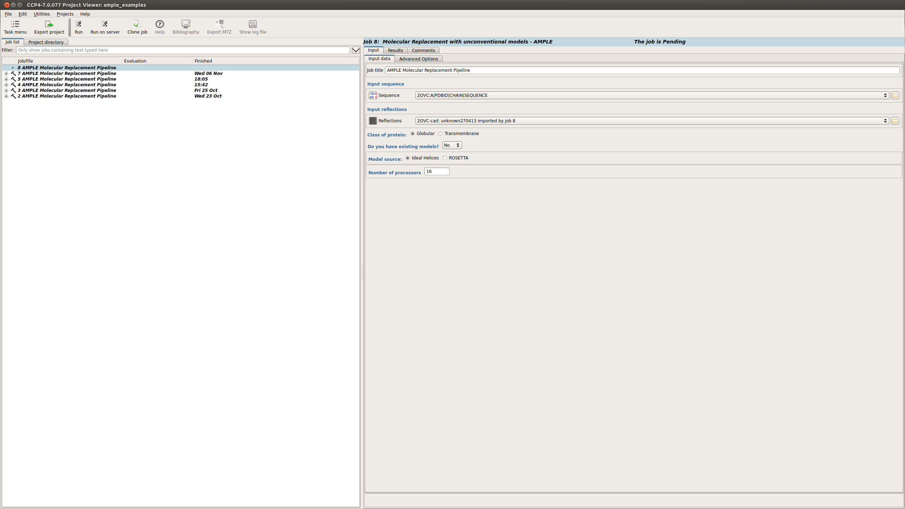
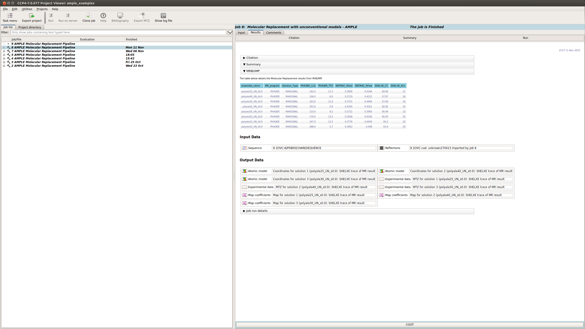
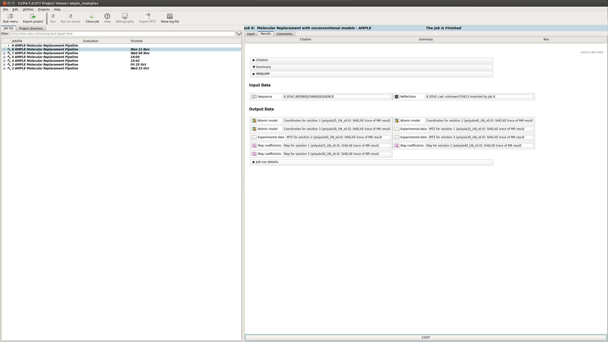
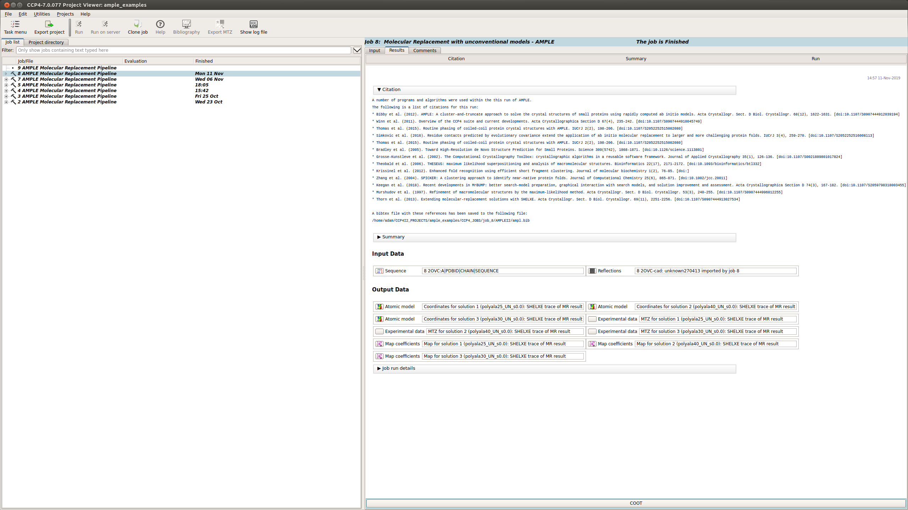

.. _example_ccp4i2_ideal_helices:

===================
Using ideal helices
===================

AMPLE can perform Molecular Replacement using a small library of ideal helices. This method requires no modelling and therefore is often very quick.

------------------------------------------------------------------

Running AMPLE
=============

AMPLE can be found in the CCP4i2 menu under the Molecular replacement tab (shown below)

.. figure:: ../images/ccp4i2_menu.png
   :align: center

This will take you to the submission page for AMPLE.

Submission options
------------------

On the submission page there are a number of input options:

.. figure:: ../images/ccp4i2_ample_submit.png
   :align: center

1. Input sequence – Path to the FASTA file
2. Input MTZ - Path to the MTZ file
3. Protein classification - Globular or Transmembrane
4. Model selection or building - select between a directory of existing models, a library of ideal helices (shown below) or create *ab initio* models locally.

Advanced options
----------------

There is also an advanced options tab

.. figure:: ../images/ccp4i2_ample_advanced.png
   :align: center

This provides options relating to:

1. The rebuilding of the structure
2. Ensembling
3. And a box to add any other run flags not already available through the GUI.

For a full list possible options see :ref:`AMPLE options <cl_options>`.

Example
=======
Input Files
-----------
AMPLE requires a FASTA file and an MTZ file in order to run. There are some other files required, which will be described below.

.. note::
   You can download all the data files `here <hhttps://github.com/rigdenlab/ample-examples/archive/master.zip>`_.

AMPLE Setup
-----------

The FASTA and MTZ files can be submitted into the fields described above

When using ideal helices the following options need to be input:

Once these options have been selected the job can be set running.

AMPLE Output
============
On starting a separate window will appear summarising the progress of AMPLE and any results. The window will contain up to three tabs, the contents of which are explained below:

Summary
-------
The summary tab contains information about the search from MrBUMP

MrBUMP Results
^^^^^^^^^^^^^^
This section displays a table with the results of running MrBUMP on each of the ensembles, for this example you will have information for the following headings.

* **ensemble_name:** this matches the name from the ensemble section.
* **MR_program:** the program used for Molecular Replacement.
* **Solution type:** the MrBUMP categorisation of the solution

  * *GOOD* - final Rfree <=0.35
  * *MARGINAL* - final Rfree <= 0.48 OR final Rfree <= 0.5 and the ratio between the initial and final Rfree is <= 0.8, OR final Rfree <= 0.55 and the ratio between the initial and final Rfree is <= 0.95
  * *POOR* - anything else
  * *no_job_directory* - a script has been prepared, but the job hasn’t been run yet
  * *unfinished* - the job is running or has stopped without generating any results

* **PHASER_LLG:** the PHASER log-likelihood gain for the Molecular Replacement solution.
* **PHASER_TFZ:** PHASER Translation Function Z-score for the Molecular Replacement solution.
* **REFMAC_Rfact:** Rfact score for REFMAC refinement of the Molecular Replacement solution.
* **REFMAC_Rfree:** Rfree score for REFMAC refinement of the Molecular Replacement solution.
* **SHELXE_CC:** SHELXE Correlation Coefficient score after C-alpha trace.
* **SHELXE_ACL:** Average Chain Length of the fragments of the SHELXE C-alpha trace.

Typically a result with a SHELXE CC score of 25 or higher **and** a SHELXE ACL of 10 or higher will indicate a correct solution.

Results
-------
The Results tab displays the final results of AMPLE after running MrBUMP on the ensembles.

AMPLE output the atomic models, MTZ and map coefficients for the top 3 solutions in the AMPLE run.

.. note::
   The results you obtain may be slightly different to those presented above as you are generating a new slightly different set of *ab initio* models.

Citations
---------
This section lists the programs and algoriths that are using in the AMPLE job and gives a list of references to be cited should AMPLE find a solution.

