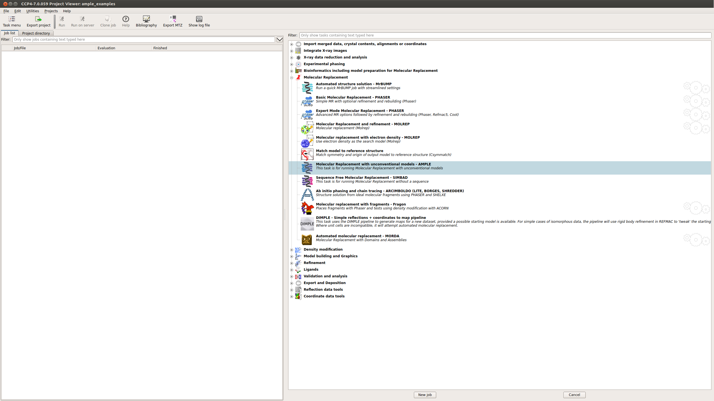
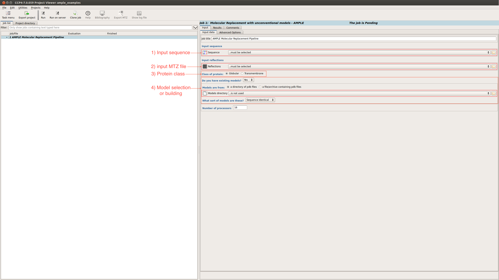
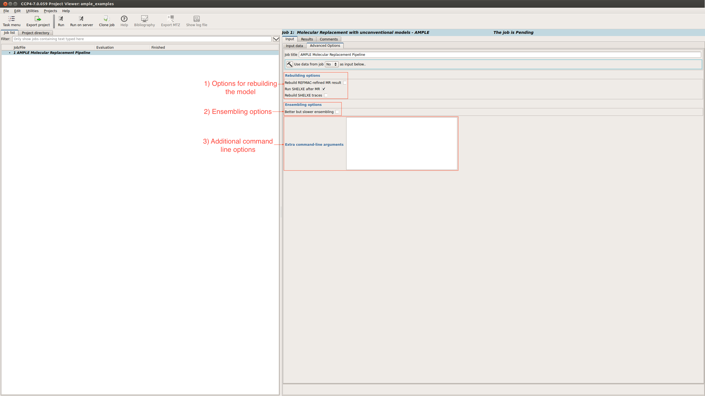
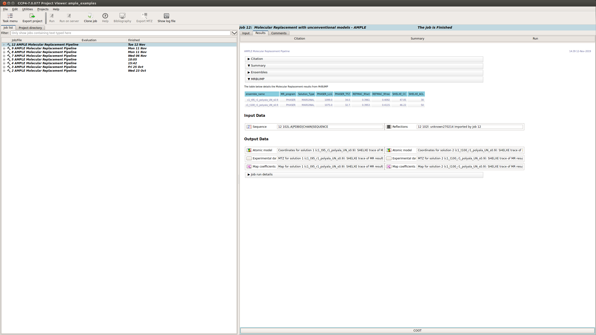
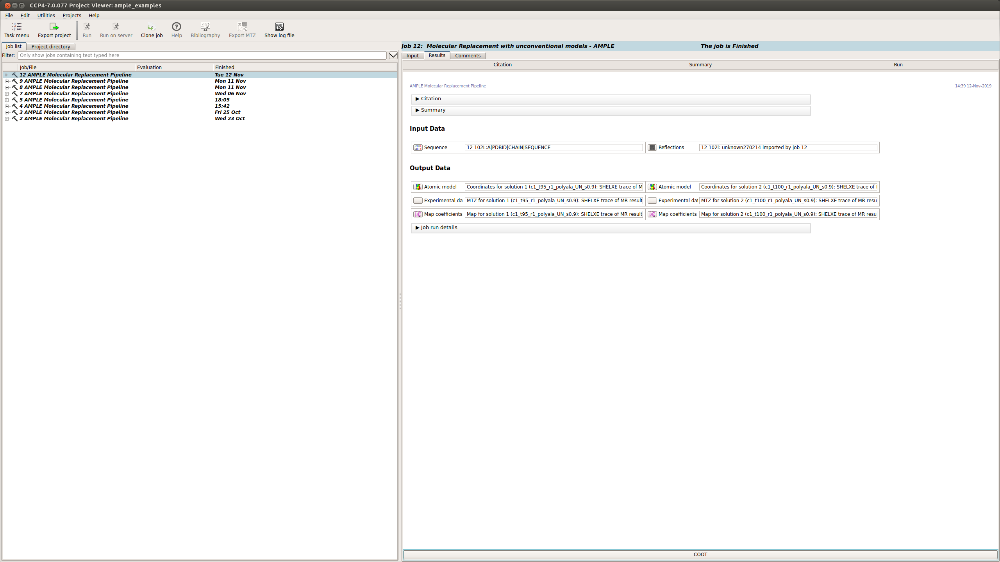

.. _example_ccp4i2_nmr_ensemble:

=====================
Using an NMR ensemble
=====================

AMPLE can attempt molecular replacement with ensembles created from NMR ensembles. In the simplest case, AMPLE will split an NMR ensemble into its constituent models and carry out its standard truncation/clustering algorithm to generate the ensembles. When used in this way, ROSETTA is not required to be installed.

------------------------------------------------------------------

Running AMPLE
=============

AMPLE can be found in the CCP4i2 menu under the Molecular replacement tab (shown below)

This will take you to the submission page for AMPLE.

Submission options
------------------

On the submission page there are a number of input options:

1. Input sequence – Path to the FASTA file
2. Input MTZ - Path to the MTZ file
3. Protein classification - Globular or Transmembrane
4. Model selection or building - select between a directory of existing models, a library of ideal helices or create *ab initio* models locally (shown below).

.. note::
    A Coiled-coil option will also be available soon

Advanced options
----------------

There is also an advanced options tab

This provides options relating to:

1. The rebuilding of the structure
2. Ensembling
3. And a box to add any other run flags not already available through the GUI.

For a full list possible options see :ref:`AMPLE options <cl_options>`.

Input Files
-----------
AMPLE requires a FASTA file and an MTZ file in order to run. For molecular replacement with ensembles created from NMR ensembles you must also supply the NMR model.

.. note::
   You can download all the data files `here <https://github.com/rigdenlab/ample-examples/archive/master.zip>`_.

AMPLE Setup
-----------

The FASTA and MTZ files can be submitted into the fields described above

When using NMR ensembles the following options need to be input:

.. figure:: ../images/ccp4i2_input_nmr.png
   :align: center

Once these options have been selected the job can be set running.

AMPLE Output
============
Upon starting a results tab will appear within the CCP4i2 interface summarising the progress of the AMPLE run. This will contain the following sections:

Summary
-------
The summary tab contains different sections. Below you can find information about each:

Ensembling Results
^^^^^^^^^^^^^^^^^^
There is a brief summary of the type of truncation that was undertaken and then a table listing each ensemble. The columns of the table are:

.. figure:: ../images/ccp4i2_summary_ensembling_nmr.png
   :align: center

* **Name:** the name of the ensemble. This is used to name the pdb file and the directory where mrbump carries out molecular replacement.
* **Truncation Level:** the percentage of the model remaining after the varying residues were pruned away.
* **Variance Threshold:** AMPLE constructs ensembles by pruning back the most variable residues based on their variance as calculated by THESEUS. The variance threshold is the THESEUS variance score for the most variable residue that remains in this ensemble.
* **No. Residues:** the number of residues for each model in the ensemble.
* **Radius Threshold:** the truncated models are sub-clustered after truncation under 3 different radius thresholds to create the ensemble, and this is the radius used for this sub-cluster.
* **No. Decoys:** the number of models within this ensemble.
* **Number of Atoms:** the number of atoms for each model in the ensemble.
* **Sidechain Treatment:**

  * *allatom* – all sidechains were retained
  * *reliable* – MET, ASP, PRO, GLN, LYS, ARG, GLU, SER were retained
  * *polyAla* – all sidechains were stripped back to polyalanine

MrBUMP Results
^^^^^^^^^^^^^^
This section displays a table with the results of running MrBUMP on each of the ensembles, for this example you will have information for the following headings.

* **ensemble_name:** this matches the name from the ensemble section.
* **MR_program:** the program used for Molecular Replacement.
* **Solution type:** the MrBUMP categorisation of the solution

  * *GOOD* - final Rfree <=0.35
  * *MARGINAL* - final Rfree <= 0.48 OR final Rfree <= 0.5 and the ratio between the initial and final Rfree is <= 0.8, OR final Rfree <= 0.55 and the ratio between the initial and final Rfree is <= 0.95
  * *POOR* - anything else
  * *no_job_directory* - a script has been prepared, but the job hasn’t been run yet
  * *unfinished* - the job is running or has stopped without generating any results

* **PHASER_LLG:** the PHASER log-likelihood gain for the Molecular Replacement solution.
* **PHASER_TFZ:** PHASER Translation Function Z-score for the Molecular Replacement solution.
* **REFMAC_Rfact:** Rfact score for REFMAC refinement of the Molecular Replacement solution.
* **REFMAC_Rfree:** Rfree score for REFMAC refinement of the Molecular Replacement solution.
* **SHELXE_CC:** SHELXE Correlation Coefficient score after C-alpha trace.
* **SHELXE_ACL:** Average Chain Length of the fragments of the SHELXE C-alpha trace.

Typically a result with a SHELXE CC score of 25 or higher **and** a SHELXE ACL of 10 or higher will indicate a correct solution.

Results
-------
The Results tab displays the final results of AMPLE after running MrBUMP on the ensembles.

AMPLE output the atomic models, MTZ and map coefficients for the top 3 solutions in the AMPLE run.

.. note::
   The results you obtain may be slightly different to those presented above as you are generating a new slightly different set of *ab initio* models.

Citations
---------
This section lists the programs and algorithms that are using in the AMPLE job and gives a list of references to be cited should AMPLE find a solution.

.. figure:: ../images/ccp4i2_citation_nmr.png
   :align: center