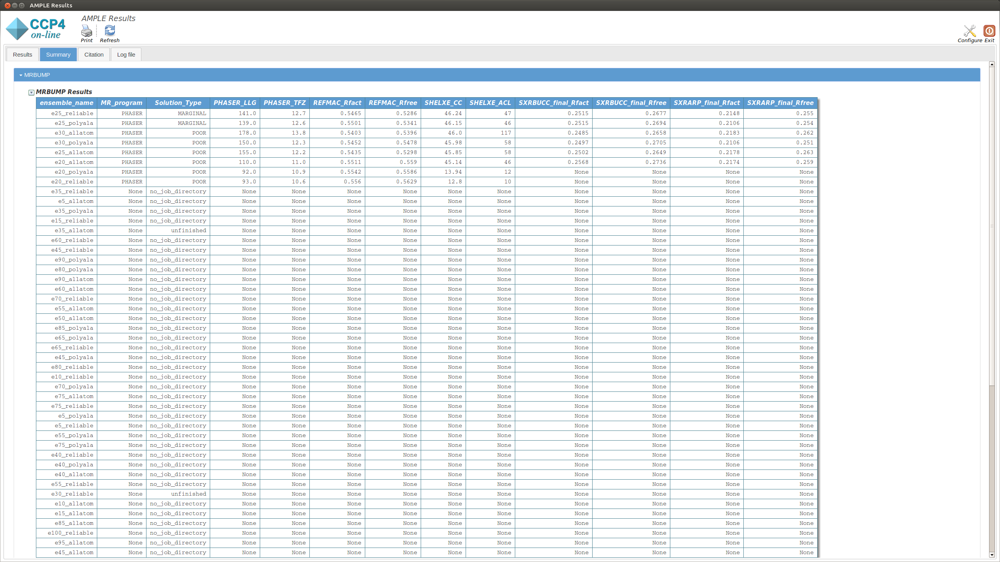
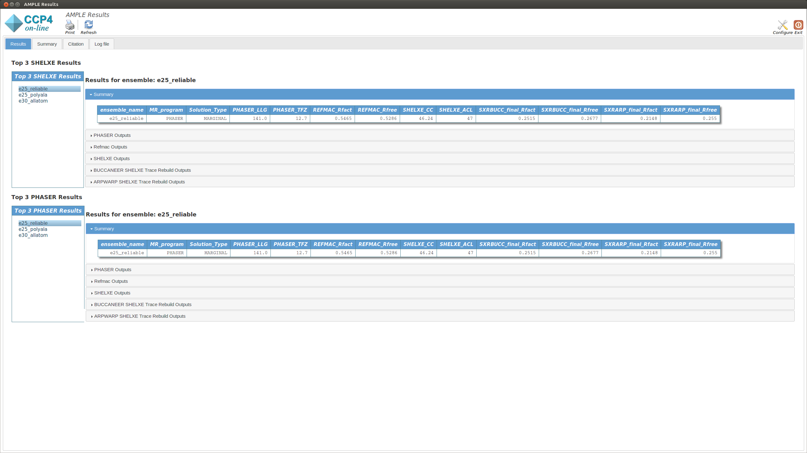
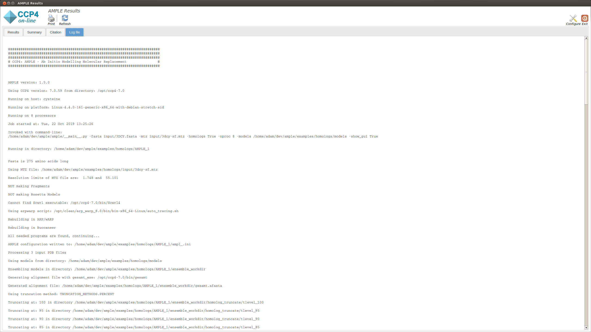
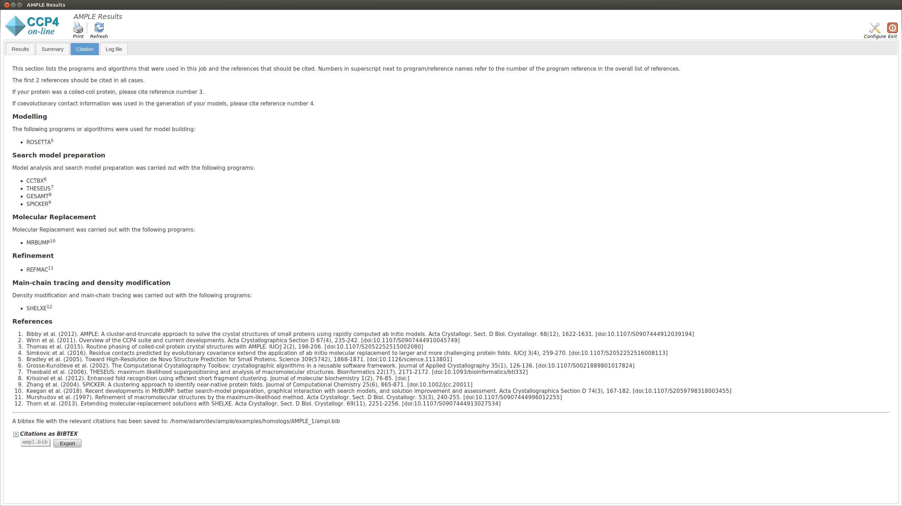

.. _example_dist_homologs:

=======================
Using multiple homologs
=======================
AMPLE can attempt molecular replacement with a number of homologous crystal structures to the target. This is something you might attempt when none of the individual structures proves sufficient alone to solve the target. AMPLE will find the structurally shared core between the homologs and use that superposition as a starting point for its clustering and truncation approach.

Running AMPLE
=============
Input Files
-----------
AMPLE requires a FASTA file and an MTZ file in order to run. It also needs the homologous structures.

.. note::
   You can download all the data files `here <https://github.com/rigdenlab/ample-examples/archive/master.zip>`_.

AMPLE Setup
-----------
System-dependent example scripts to run AMPLE are shown below:

UNIX (Linux|Mac)
^^^^^^^^^^^^^^^^

.. literalinclude:: /../examples/homologs/run.sh
   :language: bash
   :lines: 12-18

Windows
^^^^^^^

.. literalinclude:: /../examples/homologs/run.bat
   :language: batch
   :lines: 6-12

We need to provide the locations of our input files, this is done using the following flag:

* ``-fasta_input`` – for our FASTA file.
* ``-mtz_input``  – for our MTZ file.
* ``-models`` - directory containing our homolog models.

Next we can specify a few run options for AMPLE:

* ``-homologs`` – As our model directory contains homologs we need to specify that so AMPLE knows how to run.
* ``-nproc`` – Lets you specify how many processors you want to use.

.. warning::
   Although the ``-nproc`` flag is optional, the ``-homologs`` is **essential** for AMPLE to recognise that your models are homologs and not *ab initio* predictions.

For a full list of options see :ref:`AMPLE options <cl_options>`.

------------------------------------------------------------------

AMPLE Output
============
On starting a separate window will appear summarising the progress of AMPLE and any results. The window will contain up to four tabs, the contents of which are explained below:

Summary tab
-----------
This is divided into two sections that display a summary of the results of the ensembling process and the results of the Molecular Replacement with MrBUMP respectively:

MrBUMP Results
^^^^^^^^^^^^^^
This section displays a table with the results of running MrBUMP on each of the ensembles, for this example you will have information for the following headings.

* **ensemble_name:** this matches the name from the ensemble section.
* **MR_program:** the program used for Molecular Replacement.
* **Solution type:** the MrBUMP categorisation of the solution

  * *GOOD* - final Rfree <=0.35
  * *MARGINAL* - final Rfree <= 0.48 OR final Rfree <= 0.5 and the ratio between the initial and final Rfree is <= 0.8, OR final Rfree <= 0.55 and the ratio between the initial and final Rfree is <= 0.95
  * *POOR* - anything else
  * *no_job_directory* - a script has been prepared, but the job hasn’t been run yet
  * *unfinished* - the job is running or has stopped without generating any results

* **PHASER_LLG:** the PHASER log-likelihood gain for the Molecular Replacement solution.
* **PHASER_TFZ:** PHASER Translation Function Z-score for the Molecular Replacement solution.
* **REFMAC_Rfact:** Rfact score for REFMAC refinement of the Molecular Replacement solution.
* **REFMAC_Rfree:** Rfree score for REFMAC refinement of the Molecular Replacement solution.
* **SHELXE_CC:** SHELXE Correlation Coefficient score after C-alpha trace.
* **SHELXE_ACL:** Average Chain Length of the fragments of the SHELXE C-alpha trace.

Results
-------
The Results tab displays the final results of AMPLE after running MrBUMP on the ensembles.

The tab is split into two sections. The upper section shows the top three results as ranked by their SHELXE CC score. The lower section shows the top three results as ranked by their PHASER TFZ score. These may or may not be different. Within each section, the left-hand menu displays a list of ensemble names – these match the names from the Ensembles section in the Summary tab. Clicking on any item will display the results for that ensemble in the central pane. At the top is a table that matches the MrBUMP entry from the Summary tab, and there are then sections for the files output by each program run by MrBUMP. The files can either be displayed directly or opened directly with COOT or CCP4MG using the displayed buttons.

Typically a result with a SHELXE CC score of 25 or higher **and** a SHELXE ACL of 10 or higher will indicate a correct solution..

Log File
--------
This displays the text output by AMPLE as it is running. Any problems or errors will be displayed here.

Citations
---------
This section lists the programs and algoriths that are using in the AMPLE job and gives a list of references to be cited should AMPLE find a solution.

------------------------------------------------------------------

