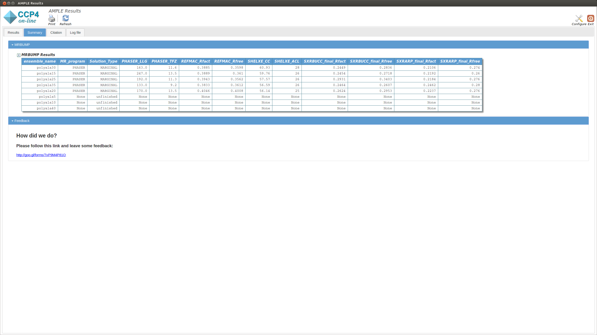
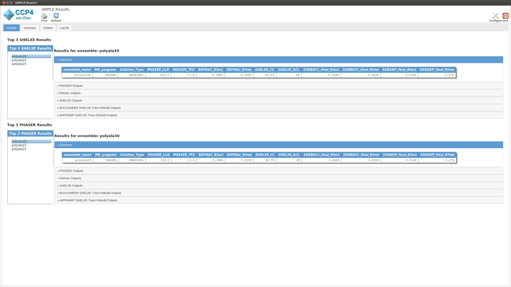
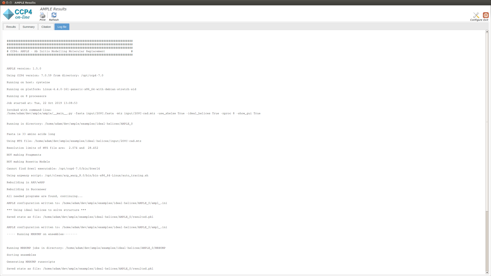
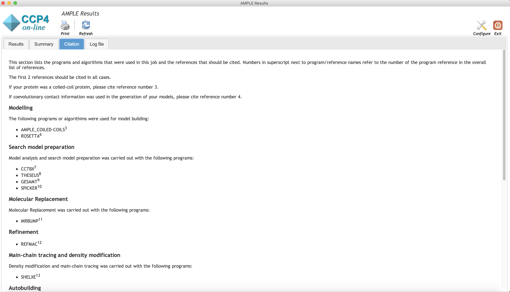

.. _example_ideal_helices:

===================
Using ideal helices
===================

AMPLE can perform Molecular Replacement using a small library of ideal helices. This method requires no modelling and therefore is often very quick.

Running AMPLE
=============
Input Files
-----------
AMPLE requires a FASTA file and an MTZ file in order to run. There are some other files required, which will be described below.

.. note::
   You can download all the data files `here <hhttps://github.com/rigdenlab/ample-examples/archive/master.zip>`_.

AMPLE Setup
-----------
System-dependent example scripts to run AMPLE are shown below:

UNIX (Linux|Mac)
^^^^^^^^^^^^^^^^

.. literalinclude:: /../examples/ideal-helices/run.sh
   :language: bash
   :lines: 12-18

Windows
^^^^^^^

.. literalinclude:: /../examples/ideal-helices/run.bat
   :language: batch
   :lines: 6-13

First we provide the location of the input files. This is done with the following flags:

* ``-fasta_input`` – location of the FASTA file.
* ``-mtz_input`` – location of the MTZ file.

Next we provide the flag that tells AMPLE to run in ideal helices mode:

* ``-ideal_helices`` - specifies whether the job should be run in ideal helices mode

Finally we provide some options about how AMPLE will run:

* ``-use_shelxe`` – specifies whether we should use shelxe or not.
* ``-nproc`` – lets you specify how many processors you want to use.
* ``-show_gui`` - Flag to display the AMPLE gui. This is set by default when running through CCP4i or CCP4i2 but must be manually set on the command line to generate the output GUI shown below.

For a full list possible options see :ref:`AMPLE options <cl_options>`.

------------------------------------------------------------------

AMPLE Output
============

On starting a separate window will appear summarising the progress of AMPLE and any results. The window will contain up to four tabs, the contents of which are explained below:

Summary
-------
The summary tab contains different sections. Below you can find information about each:

MrBUMP Results
^^^^^^^^^^^^^^
This section displays a table with the results of running MrBUMP on each of the ensembles, for this example you will have information for the following headings.

* **ensemble_name:** this matches the name from the ensemble section.
* **MR_program:** the program used for Molecular Replacement.
* **Solution type:** the MrBUMP categorisation of the solution

  * *GOOD* - final Rfree <=0.35
  * *MARGINAL* - final Rfree <= 0.48 OR final Rfree <= 0.5 and the ratio between the initial and final Rfree is <= 0.8, OR final Rfree <= 0.55 and the ratio between the initial and final Rfree is <= 0.95
  * *POOR* - anything else
  * *no_job_directory* - a script has been prepared, but the job hasn’t been run yet
  * *unfinished* - the job is running or has stopped without generating any results

* **PHASER_LLG:** the PHASER log-likelihood gain for the Molecular Replacement solution.
* **PHASER_TFZ:** PHASER Translation Function Z-score for the Molecular Replacement solution.
* **REFMAC_Rfact:** Rfact score for REFMAC refinement of the Molecular Replacement solution.
* **REFMAC_Rfree:** Rfree score for REFMAC refinement of the Molecular Replacement solution.
* **SHELXE_CC:** SHELXE Correlation Coefficient score after C-alpha trace.

Results
-------
The Results tab displays the final results of AMPLE after running MrBUMP on the ensembles.

The tab is split into two sections. The upper section shows the top three results as ranked by their SHELXE CC score. The lower section shows the top three results as ranked by their PHASER TFZ score. These may or may not be different. Within each section, the left-hand menu displays a list of ensemble names. Clicking on any item will display the results for that ensemble in the central pane. At the top is a table that matches the MrBUMP entry from the Summary tab, and there are then sections for the files output by each program run by MrBUMP. The files can either be displayed directly or opened directly with COOT or CCP4MG using the displayed buttons.

Typically a result with a SHELXE CC score of 25 or higher **and** a SHELXE ACL of 10 or higher will indicate a correct solution.

.. note::
   The results you obtain may be slightly different to those presented above as you are generating a new slightly different set of *ab initio* models.

Log File
--------
This displays the text output by AMPLE as it is running. Any problems or errors will be displayed here.

Citations
---------
This section lists the programs and algoriths that are using in the AMPLE job and gives a list of references to be cited should AMPLE find a solution.

